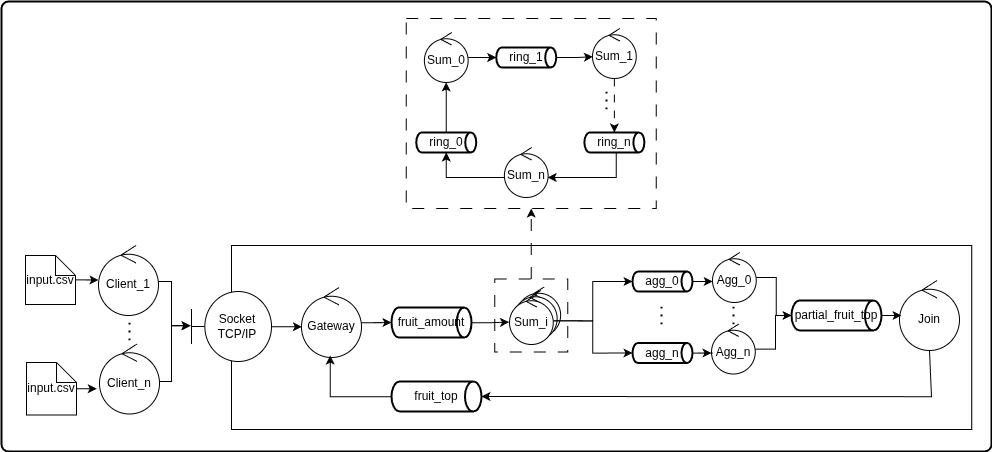

# Trabajo Práctico - Coordinación

## Autores

| Nombre | Apellido      | Mail           | Padrón |
|--------|---------------|----------------|--------|
| Ian    | von der Heyde | ivon@fi.uba.ar | 107638 |

---

## Diagrama de arquitectura

*Fig. 1: Arquitectura del sistema implementado con coordinación por anillo*

---

## Índice

1. [Supuestos](#1-supuestos)
2. [Protocolo interno de mensajes](#2-protocolo-interno-de-mensajes)
3. [Middleware](#3-middleware)
4. [Gateway y `message_handler`](#4-gateway-y-message_handler)
5. [Sum](#5-sum)
6. [Aggregation](#6-aggregation)
7. [Join](#7-join)
8. [Escalabilidad](#8-escalabilidad)
9. [Alternativas de coordinación consideradas](#9-alternativas-de-coordinación-consideradas)

---

## Visión general de la solución

Para resolver los tres problemas centrales del TP:

- **Múltiples clientes concurrentes**: cada mensaje lleva un `client_id` único generado por el gateway. Todos los componentes mantienen estado separado por cliente.
- **Coordinación de EOF entre réplicas de Sum**: el gateway cuenta exactamente cuántos mensajes `data` envió (`total_messages`) e incluye ese número en el `eof`. Las réplicas de Sum usan un **anillo de conteo**: la que recibe el `eof` circula un token sumando los counts de cada nodo; cuando la suma iguala `total_messages`, todas flushean. Si no alcanza, se reintenta.
- **Distribución de carga hacia Aggregation**: Sum hace sharding determinístico usando una clave compuesta `(client_id, fruit)` hasheada como `zlib.crc32(...) % AGGREGATION_AMOUNT`. Esto asegura que cada combinación cliente-fruta vaya siempre al mismo Aggregator, evitando broadcast y procesamiento redundante, y distribuyendo mejor la carga entre aggregators.
---

## 1. Supuestos

El diseño parte de los siguientes supuestos:

1. **Sin caída de instancias en ejecución**: ningún proceso muere mientras el sistema está procesando datos. El manejo de SIGTERM cubre el apagado ordenado, no la tolerancia a fallos en tiempo de ejecución.
2. **Comunicación estable durante la ejecución**: una vez iniciado el sistema, la conexión con RabbitMQ no se interrumpe. Si esto ocurriera, el proceso libera recursos y termina; no intenta recuperarse.
3. **FIFO dentro de cada cola**: los mensajes en una misma cola se entregan en el orden en que fueron publicados.
4. **Fairness del scheduler de RabbitMQ**: cuando hay mensajes en más de una cola, eventualmente todos son procesados.
5. **Sin reentregas en ejecución nominal**: RabbitMQ no reentrega mensajes ya procesados en condiciones normales.

Bajo estos supuestos no hay doble conteo, no hay flushes incompletos y no se necesitan mecanismos de deduplicación.

Si un cliente abandonara la sesión sin EOF, el estado por `client_id` quedaría huérfano en memoria. No se implementó TTL por sesión porque queda fuera del modelo de fallas asumido para el TP.

---

## 2. Protocolo interno de mensajes

Todos los mensajes internos son JSON codificado en UTF-8. Cada mensaje lleva obligatoriamente los campos `kind` (identifica el tipo, definido en `message_protocol.internal.Kind`) y `client_id` (permite que múltiples clientes coexistan sin mezclar estado).

| `kind` | Emisor | Cola destino | Receptor | Campos adicionales |
|---|---|---|---|---|
| `data` | Gateway | `INPUT_QUEUE` | Sum | `fruit: str`, `amount: int` |
| `eof` | Gateway / Sum (retry) | `INPUT_QUEUE` | Sum | `total_messages: int` |
| `ring_token` | Sum (líder o no-líder) | `{SUM_PREFIX}_ring_{i+1}` | Sum siguiente | `accumulated_count: int` |
| `ring_finish` | Sum (líder lo inicia; cada no-líder lo reenvía) | `{SUM_PREFIX}_ring_{i+1}` | Sum siguiente | — |
| `sum_partial` | Sum | `{AGGREGATION_PREFIX}_{i}` | Aggregation_i | `fruit: str`, `amount: int` |
| `sum_done` | Sum | `{AGGREGATION_PREFIX}_{i}` (todos) | Todas las Aggregation | `src_id: int` |
| `agg_top` | Aggregation | `join_queue` | Join | `src_id: int`, `top: [[str, int]]` |
| `final_top` | Join | `RESULTS_QUEUE` | Gateway | `top: [[str, int]]` |

**Notas**:

- `eof` es reencolado por el Sum líder cuando el anillo detecta que aún no se alcanzó `total_messages`.
- `sum_partial` se envía a un único Aggregator según hash; 
- `sum_done` se envía a todos Aggregators.
- `ring_finish` recorre el anillo completo: cada no-líder flushea y reenvía; el líder flushea al cierre y no lo reenvía.

---

## 3. Middleware

Se implementó sobre `pika.BlockingConnection`.

- `MessageMiddlewareQueueRabbitMQ`: conexión + channel + cola.
Cada instancia del middleware representa una conexión independiente.

### Conexión con reintentos

Al arrancar, RabbitMQ puede no estar disponible todavía (el contenedor está levantando). En lugar de fallar inmediatamente, cada componente reintenta la conexión con backoff exponencial: el delay entre intentos empieza en `_RETRY_BASE_DELAY` segundos y se duplica hasta un máximo de `_RETRY_MAX_DELAY`, por hasta `MAX_ATTEMPTS` intentos (configurable por variable de entorno). Si se supera ese límite, el proceso lanza `MessageMiddlewareDisconnectedError` y termina.

### Durabilidad

Todas las colas se declaran con `durable=True` y los mensajes se publican con `delivery_mode=2`. Esto garantiza que si RabbitMQ se reinicia, las colas y sus mensajes sobreviven. Bajo los supuestos del TP esto no debería ocurrir, pero lo mantuve porque no agrega complejidad de código ya que fue realizado para el TP anterior, aunque reconozco que no se aprovecha de la mejor forma en esta implementación. (En este TP el broker corre sin volumen persistente, por lo que si el contenedor se recrea el estado se pierde igualmente)

### Manejo de errores en ejecución

Si ocurre cualquier error AMQP durante el consumo o la publicación, el proceso lanza `MessageMiddlewareDisconnectedError` o `MessageMiddlewareMessageError`, libera recursos y termina. No hay recuperación, ya que por nuestros supuestos esto no debería ocurrir en condiciones normales.

---

## 4. Gateway y `message_handler`

`MessageHandler` genera un `_client_id` único (`uuid4().hex`) por conexión cliente y lo inserta en todos sus mensajes.

- `serialize_data_message`: serializa `(fruit, amount)` como `data`, incrementando `_data_count` por cada línea recibida para ese cliente.
- `serialize_eof_message`: envía `eof` con `total_messages = _data_count`.
- `deserialize_result_message`: filtra `final_top` por `client_id`.

Esto permite que múltiples clientes compartan las mismas colas internas sin mezclar estado.

---

## 5. Sum

Sum es el componente que coordina el cierre distribuido.

### Estado por cliente

Cada instancia mantiene estado particionado por `client_id`:

- `_meta_by_client`: metadatos de coordinación por cliente. Campos: `count` (mensajes `data` procesados por esta instancia), `is_leader` (`True` si esta instancia consumió el `eof` del cliente) y `total_messages` (valor del `eof`; solo válido mientras `is_leader` es `True`).
- `_partials_sum_by_client`: acumulado parcial por fruta, con forma `client_id -> fruta -> FruitItem`.

### Coordinación EOF con anillo

Cuando una instancia consume `eof` de un cliente:

1. Se marca líder para ese `client_id`.
2. Inicia `ring_token` con su `count` local (de ese cliente).
3. Cada no-líder suma su `count` y reenvía.
4. Al volver al líder:
   - si `accumulated_count == total_messages`, inicia `ring_finish`.
   - si `accumulated_count < total_messages`, reencola `eof` y reinicia ronda.
   - si `accumulated_count > total_messages`, ocurrió un error y se procede a abortar limpiamente.

El `ring_finish` se propaga por el anillo: cada nodo hace **flush** (envía sus `sum_partial` y `sum_done`) y reenvía el `ring_finish`, excepto el líder que hace flush pero no reenvía.

### Arquitectura interna

Cada Sum ejecuta dos procesos:

- `InputWorker`: consume `INPUT_QUEUE` (`data`/`eof`).
- `RingWorker`: consume `{SUM_PREFIX}_ring_{ID}` (`ring_token`/`ring_finish`).

Cada worker crea sus propias conexiones RabbitMQ dentro del proceso hijo.

### Estado compartido y locking entre workers

`InputWorker` y `RingWorker` acceden a los mismos diccionarios (`_meta_by_client`, `_partials_sum_by_client`) a través de `multiprocessing.Manager().dict()` protegidos por un `multiprocessing.Lock()`.
Como los Manager no propagan mutación in-place en estructuras anidadas, se aplica patrón copy-update-reassign bajo lock. Aunque esto introduce un costo adicional (copias), es necesario para garantizar la consistencia al trabajar con diccionarios compartidos entre múltiples procesos.

### Colas del ring y pre-declaración

Cada Sum_i usa:
- `ring_inbox`: `{SUM_PREFIX}_ring_{ID}` (entrada propia del ring).
- `next_ring_queue`: `{SUM_PREFIX}_ring_{(ID + 1) % SUM_AMOUNT}` (salida al siguiente).

Al inicializarse, el proceso padre de Sum declara las `SUM_AMOUNT` colas del ring con una conexión temporal. Esa conexión se cierra en `finally` para garantizar limpieza también si una declaración falla.

Esto evita la pérdida de mensajes de control al arranque: si `Sum_i` envía un `ring_token` antes de que `Sum_{i+1}` inicie su consumer, la cola ya existe y el mensaje queda persistido.

### Prefetch

- `InputWorker` usa `prefetch_count=1`, Esto evita que una réplica acapare demasiados mensajes de la work queue y favorece reparto más equitativo.

- `RingWorker` consume una cola exclusiva de su instancia, por lo que no hay competencia con otras réplicas sobre esa cola.

### Supervisión, cierre y señalización de errores

`SumFilter` espera en `wait_for_process_exit(sentinels)`, una llamada bloqueante que retorna cuando algún worker termina. No hay polling. Cuando retorna, hace `join(timeout=0)` para reaper el proceso y registrar su exitcode.

El `finally` de `start()` garantiza que el cierre siempre ocurre, sin importar cómo se llegó ahí. Para cada worker: `terminate()` → `join(5 s)`. Si esto falla: `kill()` → `join(2 s)` → reporte como `stuck`. Una vez terminado, se valida el exitcode: en shutdown por señal se aceptan `0` y `-SIGTERM`; en ejecución normal solo `0`. Los fallos se acumulan y se reportan juntos al final como excepción, para que `main()` termine con código de error.

Al recibir SIGTERM, el padre marca `_shutdown_requested` y reenvía la señal a los workers vivos, que salen de su loop de consumo y desbloquean el `wait_for_process_exit` naturalmente.

Los workers se crean con `daemon=True`: si el padre muere de forma inesperada (por ejemplo por SIGKILL), Python los mata sin cleanup y no quedan huérfanos.

Caso límite: si ambos workers quedaran colgados tras el SIGTERM, el wait no desbloquearía. Bajo los supuestos del TP esto no ocurre, por lo que no se agregó timeout al wait para evitar polling.

### Sharding hacia Aggregation

Durante flush, cada `FruitItem` se enruta con clave compuesta:

`shard_key = f"{client_id}\x1f{fruit}"`

Luego:

`aggregator_id = zlib.crc32(shard_key.encode("utf-8")) % AGGREGATION_AMOUNT`

Con esto se mantiene determinismo entre procesos y se reparte mejor la carga entre clientes cuando la distribución de frutas está desbalanceada.

El mensaje `sum_done` se envía a **todos** los aggregators, para que cada uno sepa cuántas instancias de Sum terminaron.

---

## 6. Aggregation

Cada instancia consume de `{AGGREGATION_PREFIX}_{ID}`.

Estado por `client_id`:

- `fruits`: acumulado por fruta de `sum_partial`.
- `done_count`: cantidad de `sum_done` recibidos.

Cuando `done_count == SUM_AMOUNT` (ya todos los Sum hicieron flush):

1. Calcula top parcial con `heapq.nlargest(TOP_SIZE, session["fruits"].values())`. (respeta los operadores de `FruitItem`)
2. Publica `agg_top` a Join.
3. Elimina la sesión del cliente.

Decidí que cada Aggregation tenga su propia cola directa (en lugar de un Exchange con fanout) porque Sum ya hace el sharding: sabe exactamente a qué aggregator mandar cada fruta.

### SIGTERM

Igual que en los demás componentes: el handler activa `_shutdown_requested`, llama a `stop_consuming()`, y el flag es verificado antes de entrar al loop para cubrir la race condition. El `finally` cierra `input_queue` y `output_queue`.

---

## 7. Join

Join consume `agg_top` desde `join_queue` y produce `final_top` a `RESULTS_QUEUE`.

Estado por `client_id`:
- `items`: fusión de top parciales por fruta.
- `received`: cantidad de `agg_top` recibidos para este cliente.

Cuando `received == AGGREGATION_AMOUNT`:

1. Calcula top final con `heapq.nlargest(TOP_SIZE, session["items"].values())`.
2. Publica `final_top` para el gateway.
3. Libera la sesión.

De esta manera Join actúa como barrera final por cliente y envía la respuesta completa.

### SIGTERM

Mismo patrón de cierre controlado que en los demás componentes.

---

## 8. Escalabilidad

### Respecto a clientes

El aislamiento por `client_id` permite concurrencia total entre clientes. Cada componente conserva estado independiente y el gateway filtra la respuesta final por `client_id`.

### Respecto a cantidad de Sum

Al aumentar `SUM_AMOUNT`:

Agregar más instancias de Sum distribuye la carga de datos de `INPUT_QUEUE` automáticamente (es una work queue). El protocolo del anillo escala linealmente: cada vuelta cuesta O(`SUM_AMOUNT`) mensajes de coordinación, independientemente del volumen de datos.

Cada instancia de Sum abre conexiones O(`AGGREGATION_AMOUNT`):

- en `InputWorker`: una conexión a `INPUT_QUEUE` y una al siguiente del ring.
- en `RingWorker`: una conexión a su inbox de ring, una al siguiente del ring, una a `INPUT_QUEUE` (solo para retry de EOF), y `AGGREGATION_AMOUNT` conexiones a Aggregation.

Lo que sí crece con `SUM_AMOUNT` es la cantidad de colas del anillo declaradas y el tráfico de coordinación, no la cantidad de conexiones por instancia.

### Respecto a cantidad de Aggregation

Al aumentar `AGGREGATION_AMOUNT`:

- disminuye la carga promedio por Aggregation
- Join espera más `agg_top` por cliente

El hash por `(client_id, fruit)` evita concentrar siempre la misma fruta en la misma instancia global y mejora balance cuando hay distribución despareja por cliente.

### Balance entre Sum y Aggregation:
Más instancias reducen carga por nodo pero aumentan overhead de comunicación; menos instancias hacen lo contrario. El rendimiento depende de encontrar un balance adecuado entre ambos.

---

## 9. Alternativas de coordinación consideradas

### 1. Single process con dos consumers en un mismo channel

Esta es la forma de resolverlo que más me gustó. El código queda realmente simple sin tener que lidiar con problemas de multi procesos o multi hilos. Aunque esta implementación quedó funcionando en la rama `implementacion-sum-con-single-channel`, se me dió a entender en clase que no es lo que se buscaba que hagamos, por lo que decidí migrarla a multiprocessing.

En esta version alternativa cada Sum consume `INPUT_QUEUE` y su `ring inbox` en un único proceso channel, registrando dos consumers sobre la misma conexión.

**Pro**: menos IPC y menos complejidad de estado compartido.

**Contra**: la correctitud queda acoplada a detalles de implementación del middleware y de la librería AMQP subyacente para soportar/alternar múltiples consumers en una misma conexión.

### 2. Reencolar `SUM_AMOUNT` copias de EOF

Propuesta de publicar múltiples EOF y confiar en reparto del broker.

- Problema: RabbitMQ no garantiza round-robin estricto; una réplica podría recibir múltiples EOF y otra ninguno.

### 3. Broadcast all-to-all de counts en lugar de anillo

La variante mantiene el mismo mecanismo de conteo que la solución elegida, pero reemplaza el anillo por dos rondas de broadcast:

1. La instancia que recibe `eof` publica `total_messages` a todas las instancias.
2. Cada instancia difunde su `count` a todas las demás.
3. Cada instancia suma N counts y compara contra `total_messages`.

**Por qué no la usé**: misma lógica de decisión que el anillo, pero mayor costo de coordinación: O(N²) mensajes/conexiones frente a O(N).

### 4. EOF con conjunto de instancias visitadas

EOF circula por `INPUT_QUEUE` acumulando IDs de Sum que lo vieron.

- Problema de liveness: una réplica rápida puede recapturar EOF repetidamente y bloquear convergencia.

### 5. Canal compartido con `global=True` + fanout de EOF

Cada Sum consume de dos colas en el mismo canal: `INPUT_QUEUE` (datos y `eof_request`) y una cola personal durable bindeada a un fanout exchange de control (`{SUM_PREFIX}_eof_{ID}`). El canal se configura con `basic_qos(prefetch_count=1, global_qos=True)`, que da **1 crédito total al canal** en lugar de 1 por consumer (por instancia de Sum).

La garantía clave: el gateway publica datos y luego `eof_request` en orden FIFO. La Sum que desencola `eof_request` sabe que todos los datos ya salieron de `INPUT_QUEUE`, están siendo procesados por alguna réplica. En ese momento publica `eof_control` al fanout exchange, que lo entrega simultáneamente a las `N` colas personales. Gracias a `global_qos=True`, ninguna réplica puede recibir `eof_control` mientras tiene un mensaje de datos sin ACKear: el crédito del canal está ocupado. Cuando llega `eof_control`, el estado parcial de esa réplica está completo y puede flushear directamente, sin conteo distribuido.

**Por qué no la usé**: el protocolo es correcto, pero se apoya casi completamente en garantías AMQP (`global_qos` + FIFO) en lugar de coordinación explícita a nivel aplicación, que es lo que el enunciado pedía diseñar.
